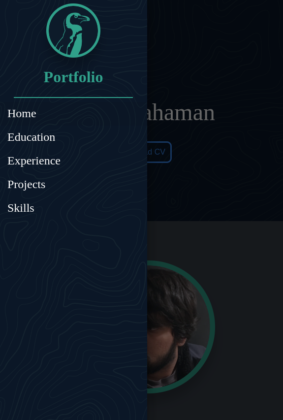

# My Portfolio

This repository is for the my portfolio website. The site is responsive using CSS Grid and good design patterns. The website is built with the Angular Framework and is utilizing Angular Material for the Mobile Nav elements. The website is located here [nabilrahaman.me]("https://nabilrahaman.me") and is hosted on Github Pages. 

## Screenshot Desktop

## Screenshot Mobile

## RoadMap
- [x] Basic Structure
- [x] Homepage is responsive
- [x] Hosted on ghpages 
- [ ] Animations using TS
- [ ] Charts for Skills list
- [ ] Expanded Project Cards
- [ ] Use Github API for Project Details

## Development server

Run `ng serve` for a dev server. Navigate to `http://localhost:4200/`. The app will automatically reload if you change any of the source files.

## Build

Run `ng build` to build the project. The build artifacts will be stored in the `dist/` directory. Use the `--prod` flag for a production build.
